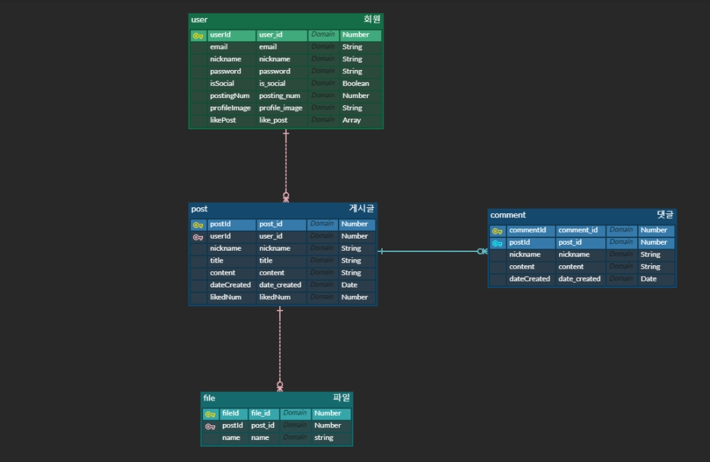
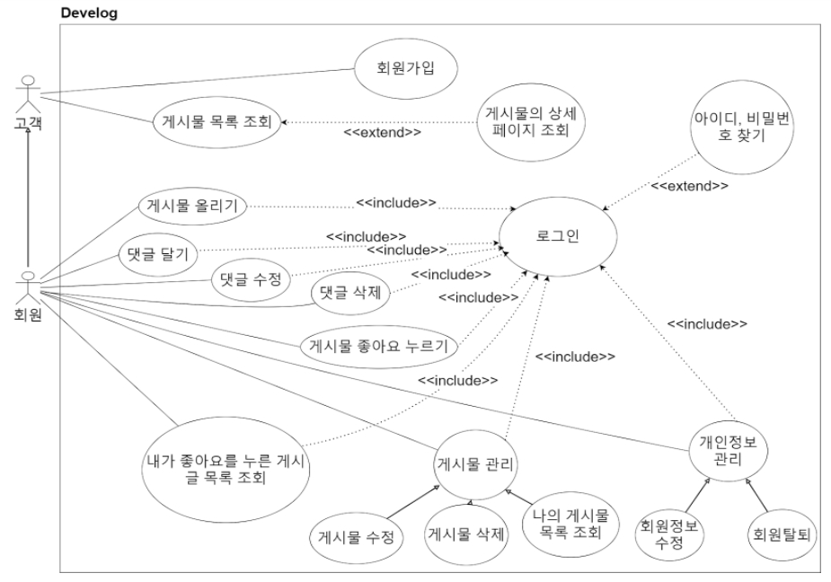
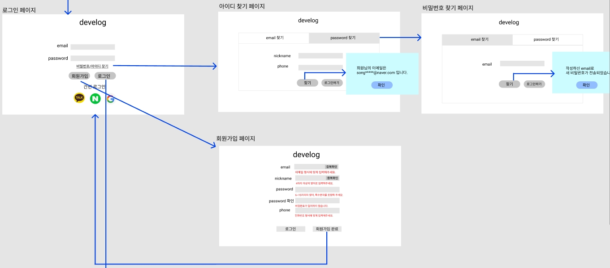
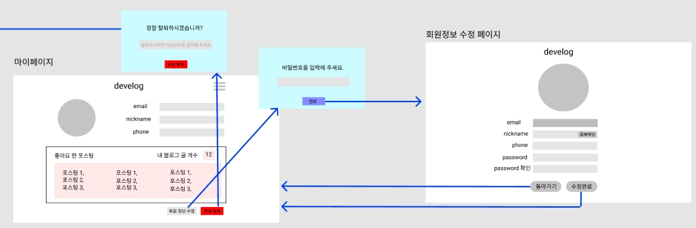
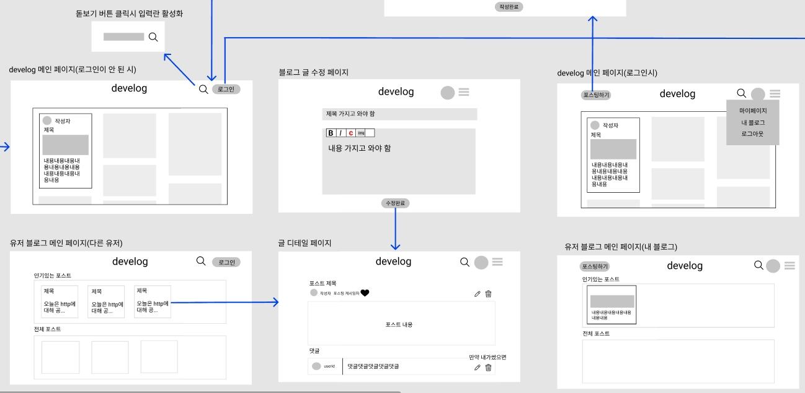
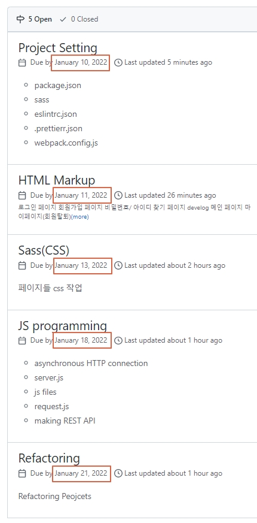

# develog

## 조원

김민성, 송진영, 안현서, 원종빈

## 프로젝트 기간

2022년 01월 10일 ~ 01월 21일

## 기획 의도

기존에 존재하던 블로그 기능을 직접 개발해봄으로써 개인의 역량을 더 키워보고자 함.

## 프로젝트 목표

jwt를 사용한 로그인 구현 + 소셜 로그인 api 사용

rest api를 사용하여 블로그 포스팅 및 수정, 삭제 기능 구현

## 메인 서비스

1. 로그인(jwt) / 회원가입 기능
2. 아이디, 비밀번호 찾기 
3. 포스팅 업로드, 수정, 삭제 기능
4. 포스팅에 댓글 작성 기능
5. 다른 유저의 포스팅 볼 수 있는 기능
6. 다른 유저의 포스팅 좋아요 기능
7. 내가 좋아요를 누른 포스팅들을 모아서 볼 수 있는 기능 

## ERD

## Usecase

## UI / 스토리보드

_자세한 UI는 오른쪽 링크를 통해 확인하실 수 있습니다._
[Figma UI Link](https://www.figma.com/file/EtaoLOngEQHhQa84e2qY3n/Untitled)

- 로그인 페이지
- 회원가입 페이지
- 비밀번호/ 아이디 찾기 페이지

- 마이페이지(회원탈퇴)
- 회원정보 수정 페이지

- develog 메인 페이지
- 내 블로그 메인 페이지
- 다른 유저의 블로그 메인 페이지
- 내 블로그 글 작성 페이지
- 내 블로그 글 수정 페이지
- 글 디테일 페이지

## 프로젝트 계획

## 기술 스택

### Frontend

- HTML, CSS, JavaScript
- webpack, sass

### Backend

- Express
- bcrypt
- JWT
